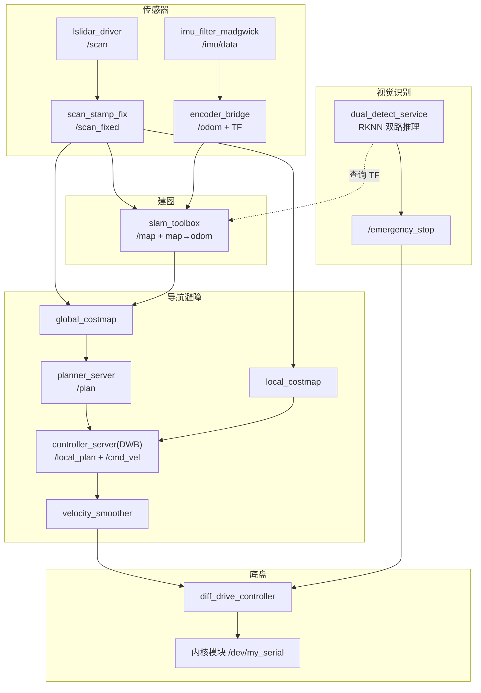

## 2026嵌入式芯片与系统设计竞赛瑞芯微赛题
## 一、项目简介
**视频地址：https://www.bilibili.com/video/BV1SiMJ6ZEAz/?vd_source=1d1fa4330aaf2a78026668081c4bd218**
---
**项目组成**
1. **Android 上位机控制端**
   - 负责小车控制、摄像头控制、双向对讲、热成像预览、报警历史查看。
   - 通过局域网与底盘、摄像头和 RK3588 识别端通信。

2. **RK3588 端双路识别服务**
   - 对可见光和热成像进行并行采集与推理。
   - 检测到目标后生成报警事件、上传 Android 端，并在 ROS2 中发布定位标注。
   - 识别结果可通过 Web 页面实时预览。
   - 二维建模，自动导航与避障，地图标注


---
**整体功能图**
   - 

## 二、项目目录结构

```text
新修改/
├─ README.md
├─ APP/
│  └─ Embedded_Android3/
│     └─ app/
│        └─ src/main/java/com/example/appcontrol/
│           ├─ MainActivity.java
│           ├─ LoginActivity.java
│           ├─ Thermal_imaging.java
│           ├─ AlertHistoryActivity.java
│           ├─ AlertServerService.java
│           ├─ AlertDialogManager.java
│           ├─ CarControlManager.java
│           ├─ CameraControlManager.java
│           ├─ IntercomManager.java
│           ├─ DetectionControlManager.java
│           └─ NetworkConfig.java
└─ ELF 2/
   ├─ rknn_yolov8_demo/
   │  ├─ 1.py
   │  ├─ camera_digest_alarm.py
   │  └─ detection_marker_bridge.py
   └─ elf_slam_ws/
      └─ src/elf_slam/elf_slam/
         ├─ diff_drive_controller.py
         ├─ encoder_bridge.py
         ├─ robot_description_publisher.py
         └─ scan_stamp_fix.py

elf_slam_ws/
└── src/
    ├── elf_slam/                       # 主包：SLAM + Nav2 + 底盘
    │   ├── launch/
    │   │   ├── online_async_launch.py        # SLAM 全栈
    │   │   ├── online_async_nav_launch.py    # SLAM + Nav2 + 底盘 + RViz
    │   │   └── save_map_launch.py            # 保存地图
    │   ├── config/
    │   │   ├── mapper_params_online_async.yaml   # slam_toolbox
    │   │   ├── nav2_params_online_slam.yaml      # Nav2 全套参数
    │   │   ├── diff_drive_params.yaml            # 底盘参数
    │   │   └── nav2_online_slam.rviz             # RViz 布局
    │   ├── scripts/start_rviz.sh                 # RViz 开机自启动
    │   ├── elf_slam/
    │   │   ├── encoder_bridge.py                 # 里程计
    │   │   ├── scan_stamp_fix.py                 # 雷达预处理
    │   │   └── diff_drive_controller.py          # 底盘驱动 + 急停
    │   ├── src/encoder_raw.c                      # GPIO 编码器
    │   └── urdf/elf_robot.urdf
    ├── imu_ros2_device/                # IMU 驱动
    ├── lslidar_driver/                 # 雷达驱动
    └── lslidar_msgs/                   # 雷达消息

```

---

## 三、系统总体流程

### 1. Android 端工作流程

- 用户在 `LoginActivity` 登录后进入主界面。
- `MainActivity` 负责：
  - 控制小车前进、后退、转向、调速；
  - 控制摄像头云台和补光灯；
  - 打开/关闭对讲监听与语音回传；
  - 打开热成像页面；
  - 查看报警历史；
  - 开启 RK3588 端识别服务。
- `Thermal_imaging` 页面负责：
  - 显示热成像 Web 预览；
  - 保持和 `MainActivity` 相同的网络配置；
  - 控制灯光、对讲、检测开关；
  - 接收报警广播并弹窗提示。
- `AlertServerService` 用于监听报警事件并向应用内广播。
- `AlertHistoryActivity` 用于查看报警图片历史。

### 2. RK3588 端工作流程

- `1.py` 启动后完成：
  - 热成像串口采集；
  - 可见光 RTSP 采集；
  - 双路 RKNN 推理；
  - 状态机联动报警；
  - 图片保存与上传；
  - ROS2 定位点标注；
  - Flask Web 预览。
- 检测到目标后会：
  - 保存报警图片；
  - 触发摄像头语音报警；
  - 上传图片和状态到 Android 端；
  - 在 ROS2 中生成地图定位点；
  - 必要时触发急停或取消导航。

---

## 四、Android 端模块说明

### 1. `MainActivity.java`

主控制页面，承担全局控制入口。

#### 主要功能

- 小车方向控制：`w/s/a/d/0`
- 小车调速
- 摄像头云台控制
- 补光灯控制
- 音频监听和对讲
- 跳转热成像页面
- 查看报警历史
- 启动检测
- 启动报警监听前台服务

#### 关键逻辑

- 通过 `NetworkConfig` 动态同步小车 IP 和摄像头 IP。
- `onResume()` 时重新启动视频播放，避免返回后黑屏。
- `onPause()` 时释放 VLC 资源，避免占用解码器和网络通道。
- 收到报警广播后调用 `AlertDialogManager.showAlertDialog()` 弹窗。

---

### 2. `Thermal_imaging.java`

热成像页面，主要用于热成像视频预览和相关控制。

#### 主要功能

- 通过 `WebView` 打开 RK3588 提供的热成像 Web 页面；
- 控制小车方向和灯光；
- 控制对讲；
- 开启检测；
- 查看报警历史；
- 接收报警广播。

#### 特点

- 页面中的 IP 地址可从 `MainActivity` 传入。
- `onStop()` 和 `onDestroy()` 中主动释放对讲、连接和广播注册，避免页面切换后资源占用。

---

### 3. `CarControlManager.java`

小车底盘控制类。

#### 主要功能

- 与小车控制端建立 TCP 连接；
- 发送方向与速度指令；
- 连接异常时自动重连；
- 退出页面时主动关闭连接。

#### 命令含义

- `w`：前进
- `s`：后退
- `a`：左转
- `d`：右转
- `0`：停止
- 数字字符串：速度值

---

### 4. `CameraControlManager.java`

摄像头 HTTP 控制类。

#### 主要功能

- 云台控制
- 补光灯控制
- 处理摄像头私有接口的认证

#### 鉴权说明

- 云台接口使用标准 HTTP Digest 鉴权；
- 补光灯接口使用摄像头固件自定义的 `X-Digest` 鉴权。

---

### 5. `IntercomManager.java`

摄像头对讲管理类。

#### 监听流程

- 通过 RTSP 建立音频拉流会话；
- 使用 RTP over TCP 接收摄像头音频；
- 将 G.711u 解码为 PCM；
- 通过 `AudioTrack` 播放。

#### 对讲流程

- 使用 `AudioRecord` 采集手机麦克风音频；
- 将 PCM 转换为 G.711u；
- 封装为 RTP 包；
- 通过 RTSP backchannel 回传到摄像头。

#### 关键处理

- 使用 `AcousticEchoCanceler` 降低回声；
- 使用 `NoiseSuppressor` 降噪；
- 使用锁保护录音和播放对象，避免关闭时并发崩溃。

---

### 6. `DetectionControlManager.java`

检测开关控制类。

#### 主要功能

- 点击“开启检测”后请求 RK3588 端的 `/detection/start`；
- 处理服务器返回状态；
- 在主线程显示 Toast。

#### 返回码说明

- `200`：检测已启动；
- `409`：当前仍有报警待确认，暂不允许启动检测。

---

### 7. `NetworkConfig.java`

网络配置中心。

#### 主要内容

- 默认服务器 IP
- 默认摄像头 IP
- RTSP 端口
- 热成像 Web 地址
- 各类接口 URL 生成函数

#### 作用

统一管理所有网络地址，避免在各个页面中硬编码。

---

### 8. `AlertHistoryActivity.java`

报警历史页面。

#### 主要功能

- 扫描本地报警图片；
- 按时间戳显示记录；
- 支持查看、确认、清空历史；
- 将图片列表渲染到 `ListView`。

#### 数据来源

报警事件由 RK3588 端上传后保存在 Android 私有目录中，历史页读取该目录下的图片进行展示。

---

### 9. `AlertDialogManager.java`

报警弹窗管理类。

#### 作用

- 在收到报警广播后弹出确认对话框；
- 提示报警时间、状态；
- 引导用户确认报警。

---

### 10. `AlertServerService.java`

报警监听前台服务。

#### 作用

- 保持应用在后台时仍能接收报警事件；
- 负责监听并向应用发送报警广播；
- 提高报警通知可靠性。

---

### 11. `LoginActivity.java`

登录页面。

#### 作用

- 作为应用入口；
- 收集或传入小车 IP、摄像头 IP；
- 进入 `MainActivity` 后完成网络配置同步。

---

## 五、RK3588 端模块说明

### 1. `1.py`

双路检测主程序。

#### 主要功能

- 热成像串口采集；
- 可见光 RTSP 采集；
- 双路 RKNN 推理；
- 状态机联动；
- 报警图片保存与上传；
- 触发摄像头语音报警；
- ROS2 定位点标注；
- Flask Web 视频预览；
- 安卓端确认接口 `/ack`；
- 检测开关接口 `/detection/start` 和 `/detection/stop`。

#### 状态机概念

程序使用状态机控制报警逻辑，主要状态包括：

- `SEARCH`：搜索目标；
- `VERIFY`：普通人体复核；
- `VERIFY_AMPUTATED_LIMB`：残肢复核；
- `COOLDOWN`：报警后等待确认。

#### 报警逻辑

- 可见光和热成像同时检测到目标时触发双路报警；
- 仅可见光检测到人体且热成像未联动时触发单路报警；
- 检测到残肢时走独立分支处理；
- 报警后暂停识别，等待 Android 端确认后恢复。

---

### 2. `camera_digest_alarm.py`

摄像头语音报警工具。

#### 作用

- 通过 Digest 鉴权登录摄像头接口；
- 调用语音报警接口触发指定音频播放；
- 为 `1.py` 的报警流程提供封装。

---

### 3. `detection_marker_bridge.py`

ROS2/RViz 标注桥接模块。

#### 作用

- 接收报警事件；
- 查询当前机器人位姿；
- 向 RViz 发布球体和文字标注；
- 发布 `PoseStamped` 定位点；
- 在报警触发时执行急停或取消导航。

---

## 六、SLAM 与底盘控制模块说明

### 1. `diff_drive_controller.py`

差速底盘控制节点。

#### 主要功能

- 订阅 `/cmd_vel`；
- 把连续速度转换为离散串口命令；
- 订阅 `/emergency_stop`；
- 收到急停后立即停车；
- 通过限频和死区减少底盘抖动。

#### 命令映射概念

- 线速度和角速度经过归一化后，决定是前进、后退、左转、右转还是停车；
- 控制板使用 ASCII 命令而不是直接速度值。

---

### 2. `encoder_bridge.py`

编码器桥接节点。

#### 作用

- 读取底盘编码器数据；
- 发布里程计相关信息；
- 供 SLAM 或导航系统使用。

---

### 3. `robot_description_publisher.py`

机器人模型描述发布节点。

#### 作用

- 发布机器人 URDF / 机器人描述信息；
- 供 RViz、TF 或机器人可视化使用。

---

### 4. `scan_stamp_fix.py`

激光扫描时间戳修正脚本。

#### 作用

- 修正扫描数据的时间戳；
- 提高 SLAM/导航中传感器同步的稳定性。

---

## 七、核心通信接口

### Android 与 RK3588 通信

- `http://<RK3588_IP>:5001/ack`
- `http://<RK3588_IP>:5001/detection/start`
- `http://<RK3588_IP>:5001/detection/stop`
- `http://<RK3588_IP>:5001/thermal_feed`
- `http://<RK3588_IP>:5001/camera_feed`

### Android 与摄像头通信

- 云台控制：`/digest/frmPTZControl`
- 补光灯控制：`/digest/frmIotLightCfg`
- 对讲：RTSP backchannel
- 监听：RTSP 音频流

### RK3588 与摄像头通信

- RTSP 取流
- HTTP Digest 语音报警
- HTTP 上传报警图片到 Android

### RK3588 与 ROS2 通信

- `/cmd_vel`
- `/emergency_stop`
- `/dual_detect_markers`
- `/dual_detect_pose`
- `/visualization_marker`
- `/visualization_marker_array`

---

## 八、运行逻辑摘要

### Android 端

1. 启动应用并登录；
2. 进入主界面；
3. 控制小车和摄像头；
4. 打开热成像页面；
5. 点击开启检测。

### RK3588 端

1. 启动串口、RTSP、RKNN、Flask、ROS2；
2. 采集热成像和可见光；
3. 执行双路识别；
4. 命中报警条件后保存图片并上传；
5. Android 弹窗确认后恢复识别。


| 子系统 | 入口 | 作用 |
|--------|------|------|
| 导航建图（ROS2 包 `elf_slam`） | `online_async_nav_launch.py` | SLAM + Nav2 + 底盘驱动 + RViz |
| 视觉识别（独立 Python 服务） | `dual_detect_service.py` | 双路 RKNN 推理 + 报警上报 + 地图标注 + 急停联动 |

---

## 2. 技术栈

### 2.1 硬件平台

| 部件 | 型号/接口 | 用途 |
|------|-----------|------|
| 主控 | RK3588（3 核 NPU） | ROS2 主控 + 视觉推理 |
| 激光雷达 | 镭神 N10，串口 `/dev/wheeltec_laser` | 建图、避障 |
| IMU | YbIMU，串口 `/dev/ttyUSB0` | 航向角 |
| 编码器 | 双轮 GPIO 四相计数 | 里程计位移 |
| 底盘电机 | H 桥 + PWM，内核字符设备 `/dev/my_serial` | 差速驱动 |
| 可见光相机 | RTSP 网络流 | 目标检测 |
| 热成像 | 32×24 测温阵列，串口 `/dev/ttyDevice2` | 体温/热源检测 |

**车体尺寸**：长 37 cm × 宽 28 cm（用于 Nav2 代价地图矩形 footprint）。

### 2.2 软件与框架

| 层次 | 技术 | 在本项目中的用途 |
|------|------|------------------|
| 操作系统 | Ubuntu 22.04 | 机器人运行环境 |
| 中间件 | **ROS2 Humble** | 节点通信、TF、Launch 编排 |
| 建图 | **slam_toolbox**（async 模式） | 在线 SLAM，发布 `/map` 与 `map→odom` |
| 导航 | **Nav2**（nav2_bringup） | 全局规划、局部避障、行为树导航 |
| 局部规划器 | **DWB**（Dynamic Window Approach） | 生成 `/local_plan`，输出 `/cmd_vel` |
| 速度平滑 | **velocity_smoother** | 加速度限制，平滑速度指令 |
| 传感器驱动 | lslidar_driver、imu_ros2_device、imu_filter_madgwick | 雷达、IMU 采集与滤波 |
| 可视化 | **RViz2** + nav2_rviz_plugins | 地图、路径、代价地图、识别点 |
| 视觉推理 | **RKNN Lite**（YOLOv8）、OpenCV | NPU 双路并行目标检测 |
| Web 服务 | **Flask** | MJPEG 推流、安卓端 HTTP 接口 |
| 底层 IO | C 程序（encoder_raw）、Linux 内核模块 | GPIO 编码器读取、电机 PWM 控制 |
| 构建 | **colcon** + ament_python | ROS2 包编译与安装 |

### 2.3 核心设计模式

- **在线 SLAM + 导航**：不依赖预存地图，`allow_unknown: true` 允许在未知区域规划。
- **开环差速底盘**：`/cmd_vel` 连续速度 → 离散方向/占空比命令，硬件不支持弧线转弯。
- **子系统解耦**：视觉服务通过 TF 查询位姿，不直接依赖导航节点。
- **报警三级停车**：急停话题直达硬件 → 取消 Nav2 目标 → 持续发零速，避免惯性前冲。

---

## 3. 系统架构与数据流

### 3.1 TF 坐标树

```text
map ──(slam_toolbox)──► odom ──(encoder_bridge)──► base_footprint
                                                      ├── base_link  (URDF)
                                                      ├── laser      (静态 TF, z=0.1m)
                                                      └── imu_link   (静态 TF, z=0.05m)
```

- `map → odom`：slam_toolbox 发布，校正里程计累积误差。
- `odom → base_footprint`：encoder_bridge 发布，编码器位移 + IMU 航向积分。
- 其余由 `robot_state_publisher` 与 `static_transform_publisher` 维护。

### 3.2 关键话题

| 话题 | 类型 | 发布者 | 订阅者/用途 |
|------|------|--------|-------------|
| `/scan` | LaserScan | lslidar_driver | scan_stamp_fix |
| `/scan_fixed` | LaserScan | scan_stamp_fix | slam_toolbox、双 costmap |
| `/imu/data` | Imu | imu_filter_madgwick | encoder_bridge |
| `/odom` | Odometry | encoder_bridge | slam_toolbox、Nav2 |
| `/map` | OccupancyGrid | slam_toolbox | global_costmap、RViz |
| `/plan` | Path | planner_server | RViz（绿色全局路径） |
| `/local_plan` | Path | controller_server(DWB) | RViz（红色局部路径） |
| `/cmd_vel` | Twist | velocity_smoother | diff_drive_controller |
| `/emergency_stop` | Bool | dual_detect_service | diff_drive_controller（急停） |
| `/dual_detect_markers` | MarkerArray | dual_detect_service | RViz（识别定位点） |
| `/visualization_marker` | Marker | dual_detect_service | RViz（单次识别标记） |

### 3.3 端到端数据流



---

## 4. 核心模块实现

### 4.1 `scan_stamp_fix`（雷达预处理）

**文件**：`src/elf_slam/elf_slam/scan_stamp_fix.py`

**解决的问题**：
1. 雷达帧时间戳过旧/为零/超前 → TF 外推失败。
2. N10 每帧波束数不固定 → slam_toolbox 拒绝扫描。
3. float32 精度导致 `angle_max/angle_increment` 不自洽 → karto 反算期望波束数错误（如 `expected 449`）。

**实现方式**：
- 订阅 `/scan`，校正 `header.stamp` 后发布 `/scan_fixed`。
- 线性插值重采样到固定 `target_beams=451`。
- **重算 `angle_max = angle_min + angle_increment × (beams-1)`**，保证三个角度参数在 float32 下严格自洽。

### 4.2 `encoder_bridge`（里程计）

**文件**：`src/elf_slam/elf_slam/encoder_bridge.py`  
**底层**：`src/elf_slam/src/encoder_raw.c`（GPIO 四相编码器）

**实现方式**：
1. 后台线程持续运行 `encoder_raw`，读取 `左轮,右轮` 脉冲计数。
2. 脉冲转距离：`m_per_tick = π × wheel_diameter / pulses_per_rev`（默认轮径 0.153m，820 脉冲/圈）。
3. 订阅 `/imu/data` 获取航向角 `yaw`。
4. 30 Hz 定时器：根据左右轮增量 + yaw 积分 `x/y`，发布 `/odom` 和 `odom→base_footprint` TF。
5. 编码器长时间无变化输出告警（车未动或 GPIO 异常）。

### 4.3 `diff_drive_controller`（底盘驱动）

**文件**：`src/elf_slam/elf_slam/diff_drive_controller.py`

**作用**：将 Nav2 输出的连续 `/cmd_vel` 映射为内核电机模块支持的**离散命令**。

**内核接口**（`/dev/my_serial`）：

| 写入 | 含义 |
|------|------|
| `w` / `s` | 前进 / 后退 |
| `a` / `d` | 原地左转 / 右转 |
| `p` | 停止 |
| 数字 `X` | PWM 占空比 = `abs(X-100)%`（如 60% 写 `40`） |

**三个硬件适配**：

1. **反向占空比映射**：目标占空比 D% → 写入 `100-D`。
2. **写入间隔 > 100ms**：内核每 100ms 轮询并清空缓冲，控制频率限制 ≤ 8 Hz，每周期最多写一条命令。
3. **按变化下发 + 停车静默**：仅在方向/占空比变化时写入；停车补发 `stop_repeat` 次 `p` 后静默，避免与手机 APP 抢占串口。

**运动决策**（`_resolve_target`）：

```text
nv = |v|/max_v,  nw = |w|/max_w
若均低于死区 → 停止
若 nw ≥ nv × turn_bias → 原地转弯（固定 turn_duty=80%）
否则 → 直行（占空比在 min_duty~max_duty 间线性映射，60%~90%）
```

**急停通道**（`/emergency_stop`）：

- 订阅 `std_msgs/Bool`，收到 `True` 时在回调中**立即**写 `p` 停车，清空残留 cmd_vel，锁存急停状态。
- 急停期间控制循环强制停车，忽略所有 `/cmd_vel`。
- 收到 `False` 解除锁定，恢复正常控制。

### 4.4 Nav2 导航与避障

**配置**：`src/elf_slam/config/nav2_params_online_slam.yaml`  
**启动**：`online_async_nav_launch.py` 通过 `nav2_bringup/navigation_launch.py` 拉起全套 Nav2 节点。

**实现链路**：

1. **global_costmap**：订阅 `/map`（slam_toolbox 实时地图）+ `/scan_fixed`（动态障碍），用于全局路径规划。
2. **local_costmap**：3×3 m 滚动窗口，仅 `/scan_fixed`，用于局部避障。
3. **planner_server**（Navfn）：在全局代价地图上规划 `/plan`。
4. **controller_server**（DWB）：在局部代价地图上采样轨迹，输出 `/local_plan` 和 `/cmd_vel`。
5. **velocity_smoother**：限制加减速，平滑后送给底盘。
6. **bt_navigator**：行为树管理导航状态（规划、跟随、恢复等）。

**车体轮廓**（矩形 footprint，替代原圆形 `robot_radius`）：

```yaml
footprint: "[[0.185, 0.14], [0.185, -0.14], [-0.185, -0.14], [-0.185, 0.14]]"
```

以 `base_footprint` 为中心：前后各 0.185 m（37 cm），左右各 0.14 m（28 cm）。局部/全局 costmap 均使用此轮廓做膨胀避障。

**关键速度参数**：

| 参数 | 值 | 说明 |
|------|----|------|
| `max_vel_x` | 0.5 m/s | 最大直行速度 |
| `max_vel_theta` | 1.5 rad/s | 最大角速度 |
| `vtheta_samples` | 40 | DWB 转向采样数 |
| `sim_time` | 1.2 s | 轨迹预测窗口 |
| `inflation_radius` | 0.35 / 0.45 m | 局部/全局膨胀半径 |

### 4.5 `dual_detect_service.py`（视觉识别与报警联动）

**文件**：工作区根目录 `dual_detect_service.py`（独立 Python 服务，非 colcon 包）

**线程架构**：

| 线程 | 职责 |
|------|------|
| 采集线程 | 热成像串口解析（0x5A 帧头 → 24×32 温度矩阵）、可见光 RTSP 拉流 |
| 推理线程 ×2 | RKNN Lite 绑定 NPU Core 1/2，YOLOv8 双路并行推理 |
| 逻辑线程 | 状态机 SEARCH → VERIFY → COOLDOWN，融合双路结果触发报警 |
| ROS2 桥接线程 | `DetectionMarkerBridge` 节点，查询 TF、发布 Marker、联动停车 |
| Flask 主线程 | MJPEG 推流、`/ack`、`/detection/start|stop` HTTP 接口 |

**识别 → 地图标注流程**：

1. 逻辑线程调用 `trigger_alarm(status, now)`。
2. 暂停识别（`detection_enabled=False`），进入 COOLDOWN，等待安卓端 `/ack` 确认。
3. 调用 `enqueue_detection_marker()` → ROS2 桥接节点：
   - 查询 `map → base_footprint` TF，获取当前地图坐标。
   - 发布 `/dual_detect_pose`、`/dual_detect_markers`、`/visualization_marker`。
4. 并行：保存截图、HTTP 上报安卓端、触发摄像头语音报警。

**报警 → 停车联动**（三级保障）：

```text
trigger_alarm()
  ├─ ① 立即发布 /emergency_stop=True
  │     └─ diff_drive_controller 回调中直接写 'p'，绕过 velocity_smoother 减速斜坡
  ├─ ② 异步取消 Nav2 导航目标（/navigate_to_pose/_action/cancel_goal）
  └─ ③ 持续 1s 向 /cmd_vel 发零速（双保险，阻止规划器继续输出）
```

**解除急停**：安卓端调用 `/detection/start` 重新开始检测时，发布 `/emergency_stop=False`，允许后续重新下发导航目标。

### 4.6 RViz 可视化

**配置**：`src/elf_slam/config/nav2_online_slam.rviz`

已预配置全部显示项，**无需手动添加**：

| 显示项 | 话题 | 说明 |
|--------|------|------|
| Map | `/map` | 实时建图 |
| LaserScan | `/scan_fixed` | 雷达点云 |
| Global/Local Costmap | `/global_costmap/costmap`、`/local_costmap/costmap` | 代价地图（半透明） |
| Global Path | `/plan` | 绿色全局路径 |
| Local Path | `/local_plan` | 红色局部路径 |
| Goal Pose | `/goal_pose` | 紫色目标箭头 |
| Detection Markers | `/dual_detect_markers` | 识别定位点集合 |
| Detection Marker | `/visualization_marker` | 单次识别标记 |
| RobotModel | `/robot_description` | 车体模型 |

**开机自启动**：`src/elf_slam/scripts/start_rviz.sh`

```bash
chmod +x ~/elf_slam_ws/src/elf_slam/scripts/start_rviz.sh
# 配置 ~/.config/autostart/elf-rviz.desktop 指向该脚本
```

脚本自动加载 ROS 环境、探测 `DISPLAY`、直接读取源目录 rviz 配置（改配置无需重新 colcon build）。

> **注意**：RViz 必须在有图形桌面的终端运行（NoMachine 远程桌面），纯 SSH 终端无 `DISPLAY` 会报 `could not connect to display`。

---

## 5. Launch 编排

### 5.1 `online_async_launch.py`（SLAM 基础栈）

启动顺序：robot_state_publisher → 静态 TF → 雷达驱动 → scan_stamp_fix → IMU 驱动/滤波 → encoder_bridge → slam_toolbox。

### 5.2 `online_async_nav_launch.py`（完整系统）

在 SLAM 基础栈之上追加：

1. Nav2 全套节点（`navigation_launch.py` + `nav2_params_online_slam.yaml`）
2. `diff_drive_controller`（底盘驱动）
3. `rviz2`（加载 `nav2_online_slam.rviz`）

**Launch 参数**：

| 参数 | 默认 | 说明 |
|------|------|------|
| `use_rviz` | true | 是否启动 RViz |
| `use_diff_drive` | true | 是否启动底盘驱动 |
| `enable_motor` | true | 是否真正写 `/dev/my_serial`（调试设 false） |

---

## 6. 编译与运行

### 6.1 编译

```bash
cd ~/elf_slam_ws
colcon build --packages-select elf_slam
source install/setup.bash
```

建议首次使用 `--symlink-install`，之后改 yaml/launch/rviz 无需重新编译。

### 6.2 启动

```bash
# 完整系统：建图 + 导航 + 避障 + 底盘 + RViz
ros2 launch elf_slam online_async_nav_launch.py

# SSH 无界面调试
ros2 launch elf_slam online_async_nav_launch.py enable_motor:=false use_rviz:=false

# 仅建图（不导航）
ros2 launch elf_slam online_async_launch.py

# 视觉识别（另开终端）
python3 ~/elf_slam_ws/dual_detect_service.py
```

### 6.3 电机内核模块

```bash
sudo insmod <motor_module>.ko
sudo mknod /dev/my_serial c <major> 0
sudo chmod 666 /dev/my_serial
```

### 6.4 下发导航目标

- **RViz**：工具栏 "Nav2 Goal"，在地图上点击并拖拽朝向。
- **命令行**：
```bash
ros2 topic pub --once /goal_pose geometry_msgs/PoseStamped \
  "{header: {frame_id: 'map'}, pose: {position: {x: 1.0, y: 0.0}, orientation: {w: 1.0}}}"
```

### 6.5 保存地图

```bash
ros2 launch elf_slam save_map_launch.py map_path:=/home/elf/elf_map
```

---

## 7. 常见问题排查

| 现象 | 原因 | 处理 |
|------|------|------|
| `executable 'diff_drive_controller' not found` | install 未同步 | 重新 `colcon build` |
| `parameter 'height' invalid type` | costmap width/height 为浮点 | 改为整数 |
| slam 报 `expected 449` 且无 `/map` | 波束角度不自洽 | scan_stamp_fix 已修复 |
| `rviz2: could not connect to display` | SSH 无图形界面 | 在 NoMachine 桌面终端运行，或 `export DISPLAY=:0` |
| RViz 只有 Grid/Map，缺路径等 | 未加载 rviz 配置文件 | 用 `-d` 指定配置，或重新 colcon build |
| 雷达狂刷 `error` | 串口失败（电机干扰/掉电） | 雷达独立供电、检查 USB |
| `Failed to make progress` | 车未动 / 编码器无计数 | 接通电机、确认 `/odom` 更新 |
| 看不到红色局部路径 | 被代价地图遮挡 | 已调低透明度；需下发导航目标后才有 |
| 手机 APP 卡顿 | ROS 与 APP 抢 `/dev/my_serial` | 已改为按变化下发 + 停车静默 |
| 报警后车辆还往前冲 | velocity_smoother 减速斜坡 | 已加 `/emergency_stop` 直达硬件停车 |

---

## 8. 调参指南

### 8.1 开环底盘（拐弯偏差）

底盘为开环控制，硬件只支持原地转/直行，无法走平滑弧线：

| 想要的效果 | 调整 |
|-----------|------|
| 拐弯过冲、左右摆 | 降低 `turn_duty`，或提高 `control_rate_hz`（≤8） |
| 拐弯不积极、走斜线 | 降低 `turn_bias`（如 0.4） |
| 走走停停太频繁 | 提高 `turn_bias`（如 0.8） |
| 整体太慢 | 提高 `min_duty`、Nav2 `max_vel_x` |
| 低速堵转 | 提高 `min_duty` |

### 8.2 避障与车体尺寸

- footprint 已按 37×28 cm 配置；若 `base_footprint` 不在车体几何中心，调整前后 X 值不对称。
- 窄道过不去：降低 `inflation_radius`（局部 0.2~0.25 m）。

### 8.3 报警停车响应

- 急停由 `/emergency_stop` 直达硬件，响应约一个内核轮询周期（~100 ms）。
- 若仍觉得慢：检查 `enable_motor:=true`、内核模块是否正常加载。
